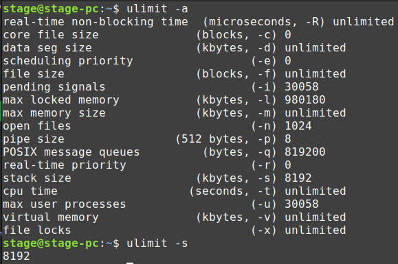

# Understanding Stack and Heap Memory in C++

## Summary

- Memory in a program is divided into different areas, with two important ones being the stack and the heap.
- Stack memory has a predefined size and is used for storing local variables and function call management.
- Heap memory, on the other hand, is dynamically allocated and can grow and change as the program runs. It's used for dynamic memory allocation using functions like new in C++.
- **_Both stack and heap memory are physically present in RAM and are managed by the operating system_**.
- Stack memory allocation is fast and straightforward, typically involving moving the stack pointer to allocate memory.
- Heap memory allocation is more complex, involving bookkeeping and potentially requesting memory from the operating system.
- It's generally recommended to allocate memory on the stack whenever possible due to its speed and efficiency.
- However, heap memory is necessary when you need memory that outlives the scope of a function or when you need to allocate large amounts of memory.
  Proper memory management, including deallocating memory when it's no longer needed, is crucial, especially when using heap memory.

## Default stack size in Linux

- `ulimit -s` - It will give the default stack size in kilobytes.
- `ulimit -a`
  - The ulimit -a command displays the current resource limits for the current shell session. Here's what each parameter represents:
    - real-time non-blocking time (microseconds, -R): Specifies the maximum amount of real-time non-blocking time in microseconds.
    - core file size (blocks, -c): Maximum size of core files that can be created, in blocks.
    - data seg size (kbytes, -d): Maximum size of the data segment for the process, in kilobytes.
    - scheduling priority (-e): Maximum scheduling priority.
    - file size (blocks, -f): Maximum file size, in blocks.
    - pending signals (-i): Maximum number of pending signals.
    - max locked memory (kbytes, -l): Maximum amount of memory that can be locked into RAM, in kilobytes.
    - max memory size (kbytes, -m): Maximum resident set size (maximum amount of memory the process can use), in kilobytes.
    - open files (-n): Maximum number of open file descriptors.
    - pipe size (512 bytes, -p): Maximum size of pipes, in bytes
    - POSIX message queues (bytes, -q): Maximum size of POSIX message queues, in bytes.
    - real-time priority (-r): Maximum real-time priority.
    - stack size (kbytes, -s): Default stack size for new threads, in kilobytes.
    - cpu time (seconds, -t): Maximum CPU time, in seconds.
    - max user processes (-u): Maximum number of user processes.
    - virtual memory (kbytes, -v): Maximum amount of virtual memory available, in kilobytes.
    - file locks (-x): Maximum number of file locks.

## In Detail

- Memory in a program is divided into different areas, with two important ones being the stack and the heap.
- The tutorial aims to explain the differences between stack and heap memory allocation in C++.

## 1. Stack Memory

- Predefined size (usually around 2 megabytes).
- Used for:
  - Storing local variables.
  - Managing function calls.
- Allocated memory:
  - Fast and straightforward.
  - Involves moving the stack pointer.
- Deallocation:
  - Automatically handled when the scope ends.
  - Stack pointer moves back to its previous position.

## 2. Heap Memory

- Dynamically allocated.
- Can grow and change during program execution.
- Used for:
  - Dynamic memory allocation using `new` keyword.
- Allocation process:
  - More complex.
  - Involves bookkeeping and potentially requesting memory from the operating system.
- Deallocation:
  - Requires manual intervention (e.g., using `delete` keyword).
  - Smart pointers (`std::shared_ptr`, `std::unique_ptr`) help manage deallocation.

## 3. Stack vs. Heap Allocation

- Recommendation:
  - Allocate on the stack whenever possible.
  - Stack allocation is faster and more efficient.
- Use heap allocation when:
  - Memory needs to outlive the scope of a function.
  - Large amounts of memory need to be allocated.
- Proper memory management is crucial:
  - Deallocate heap memory when no longer needed.
  - Failure to deallocate heap memory can lead to memory leaks.

## 4. Performance Considerations

- Stack allocation:
  - Immediate and efficient.
  - Typically involves fewer cache misses.
- Heap allocation:
  - More complex and slower.
  - Involves requesting memory from the operating system.
  - Can lead to fragmentation and cache misses in certain scenarios.

## Conclusion

- Understanding stack and heap memory allocation is essential for efficient memory management in C++ programs.
- Proper usage of stack and heap memory can significantly impact program performance and resource utilization.
